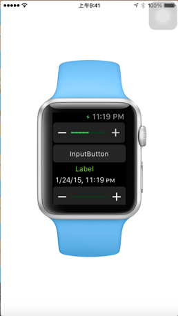

# AppleWatchCapture

Capture AppleWatch Simulator  and transfer to your IOS device

##  what is this
This is a small tool to help you running your Apple Watch  APP  on your IOS device (Actually ,mirror Apple Watch Simulator to IOS device). So you can have a better understanding of how your watch App will look before you can get a real Apple Watch.

## how to use

1.Running your Watch App on Apple Watch Simulator

2.Running AWCapture-OSX on your MAC.

3.Running AWCapture-IOS  on your IOS device .

Have fun.

## TODO

Now this project is more like a demo project now ,so there is a lot to do.

1. Optimize performance. (now ,it always drop frame )
2. Turn IOS gesture into Mac Mouse Event, So as to control Apple Watch on IOS device.
3. Adaptor to 38mm Apple Watch . (now it just work with 42mm Apple Watch Simulator for simplicity)

